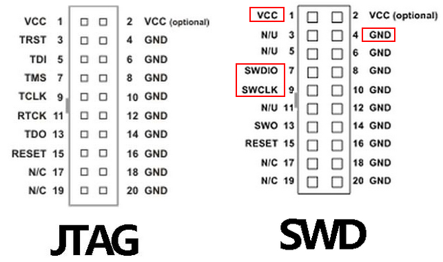
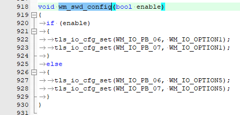
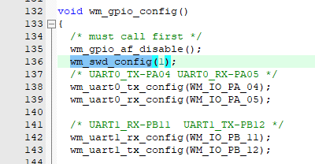
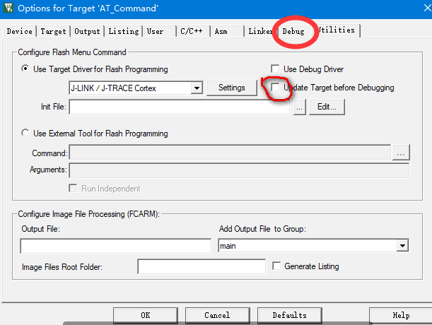
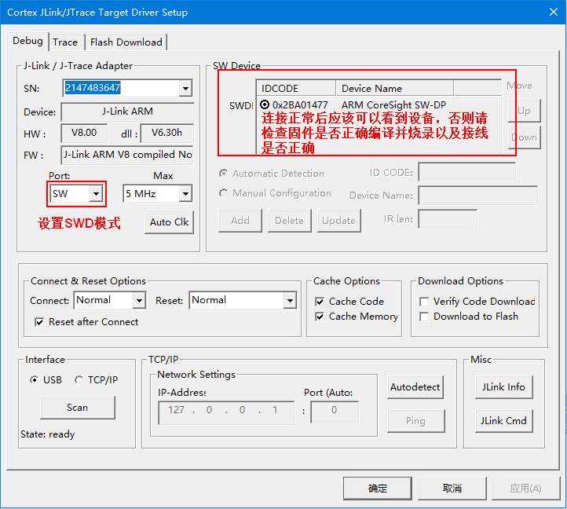
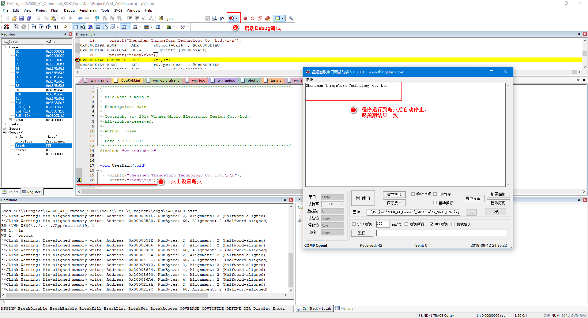

如何使用 Jlink 进行单步调试
=============================

.. note::
    本教程非官方调试方法，目前尚不能在线下载，仅供临时参考使用。

1 硬件连接 Jlink
------------------------

下面是20针牛角接口的SWD接口图，注意方向，切勿接反！

SWDIO 和 SWCLK 分别对应 W600 的 PB6 和 PB7

2 使能固件 SWD 功能
------------------------

找到函数 wm_main.c
第132行，在 wm_gpio_config() 函数中加入 wm_swd_config(1);，使swd上电后使能。

修改后需重新编译固件并烧录（建议点击 ReBuild 重新编译），W600 的 SWD 功能方可生效。

3. 配置 Jlink
------------------------

打开项目配置，关闭 Debug 前的自动下载

点击 Jlink 的 Settings，将调试接口改为SWD，此时，若连接正常，应该可以看到设备信息读取成功。

4 开始 Debug
------------------------

设定一个断点，点击 Debug 按钮，开始调试。

5 结束
------------------------
接下来，请尽情享受摆脱 printf 的快感吧~
