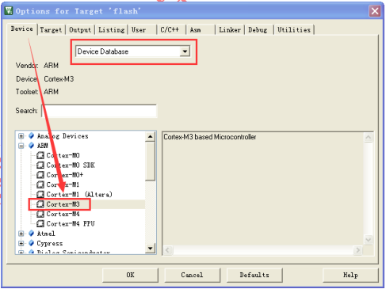
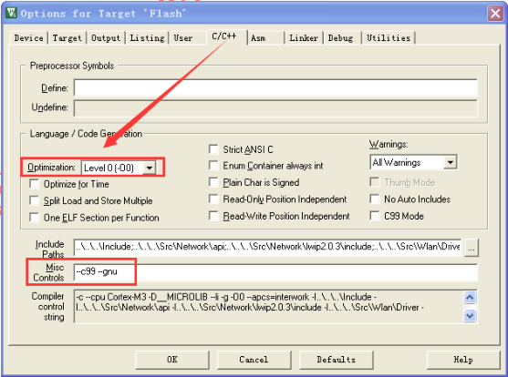
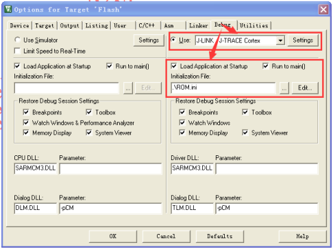

W600 SWD调试
============

1.简介
------

本文主要介绍W600芯片（基于cortex-m3） Keil环境下的在线调试配置方法。

2. W600芯片调试接口
-------------------

W600 芯片 32Pin 封装 Pin26（PB6），Pin27（PB7）分别对应 SWDIO（TMS）和
SWCLK（TCK），将芯片的 SWDIO、SWCLK、GND 和 VCC 与调试的 SWD 接口相连。

**注意：由于芯片的 SWD
接口复用有其它功能，一旦复用为其它功能则芯片将不支持在线调试功能，此时只能通过串口协议下载合法的固件。**

3.Keli环境配置
--------------

3.1芯片选择
~~~~~~~~~~~

选择 *Project->Options for Target* 打开对话框，切换到 *Device*
标签界面，选择 *ARM->Cortex-M3* 内核

|image0|

3.2配置Flsh和RAM地址
~~~~~~~~~~~~~~~~~~~~

选择 **Project->Options for Target**
打开对话框，切换到\ *Target*\ 标签界面，配置芯片的\ **Flash**\ 和
**RRAM** 参数。

|image1|

注意：配置的地址范围不能超过芯片的实际大小

3.3 配置优化等级
~~~~~~~~~~~~~~~~

选择 **Project->Options for Target** 打开对话框，切换到 **C/C++**
标签界面，如果需要在线调试跟踪程序必须将优化等级设置为 **Level
0**\ ，否则开启优化后的代码实时运行逻辑和实际代码组织结构间存在差异，影响调试。

|image2|

3.4调试器选择与配置
~~~~~~~~~~~~~~~~~~~

先将下列代码贴入记事本并保存为.ini 格式的文件

FUNC void Setup (void) { ​ SP = \_RDWORD(0x800E000); // Setup Stack
Pointer ​ PC = \_RDWORD(0x800E004); // Setup Program Counter ​
\_WDWORD(0xE000ED08, 0x800E000); // Setup VTOR } LOAD %L INCREMENTAL //
load the application Setup(); // Setup for Running g, \_main

选择 **Project->Options for Target** 打开对话框，切换到 **Debug**
标签界面 1. 选中 **Use**\ ，并从下拉框中选择使用的仿真器 2.
导入保存的.ini 格式文件，主要完成 SP 和 PC
指针及中断向量表起始地址的初始 化。

注意：SP、PC 和 VTOR 的值与 Flash 配置的起始地址有关，同时芯片不支持在
RAM 中运行程序。

|image3|

3.5Utilities 配置
~~~~~~~~~~~~~~~~~

1. 将 W600 Flash 驱动拷贝到 KEI
   安装目录的:raw-latex:`\ARM`:raw-latex:`\Flash `目录中
   北京联盛德微电子有限责任公司

2. 选择 Project->Options for Target 打开对话框，切换到 Utilities
   标签界面 ， 按下图选择 1、2，在 3 的下拉框中选择使用的仿真器必须与
   Debug 标签中的选择一致

   |image4|

上图中，点击 **Setting** ，如下图 **Flash Download** 标签中配置 **RAM**
和 **Flash** 参数必须与前面配置的地址一致，点击 **Add** 按钮选择
**W600** 芯片的 **Flash** 驱动。

|image5|

接上图切换到 **Debug** 标签，如下图按 1 的方式选择调试器接口，正确检测到
**W600** 芯 片后会显示框 2 中的芯片信息。

|image6|

最后选择 **确定** 逐级保存所有配置。

4.调试程序
----------

完成 Keil 环境配置，编译程序无误后，选择 Debug->Start/Stop Debug Session
或 CTRL+F5，进行程序的在线调试。

5.注意事项
----------

1. 通过上述配置在线调试时，不支持 Kei IDE
   环境的复位功能，此时需要重新下载 程序进入在线调试模式。
2. 由于芯片的 SWD
   接口复用有其它功能，一旦复用为其它功能则芯片将不支持在线
   调试功能，此时只能通过串口协议下载合法的固件。
3. 在线调试后会破坏芯片内部的启动参数，芯片复位后会进入串口更新固件模式。

.. |image1| image:: sdk_swd.assets/2.png

.. |image4| image:: sdk_swd.assets/5.png
.. |image5| image:: sdk_swd.assets/6.png
.. |image6| image:: sdk_swd.assets/7.png

