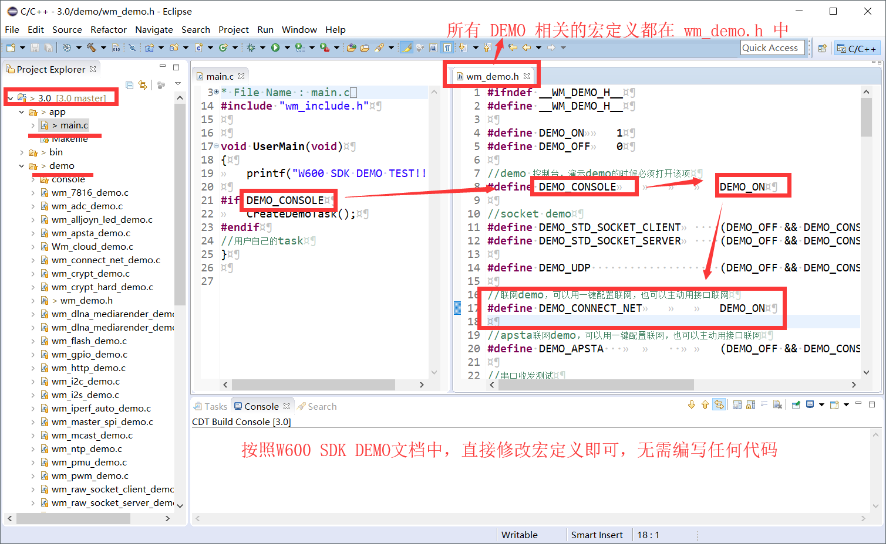
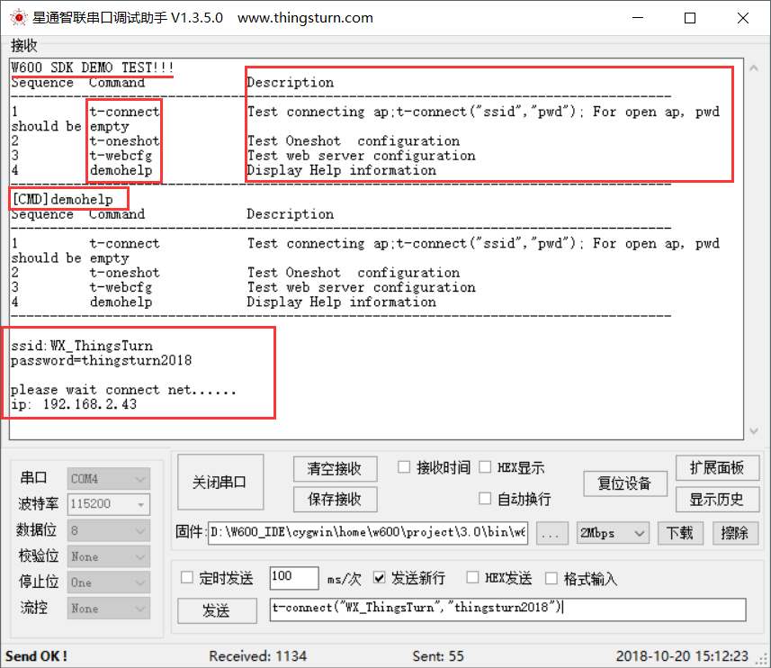
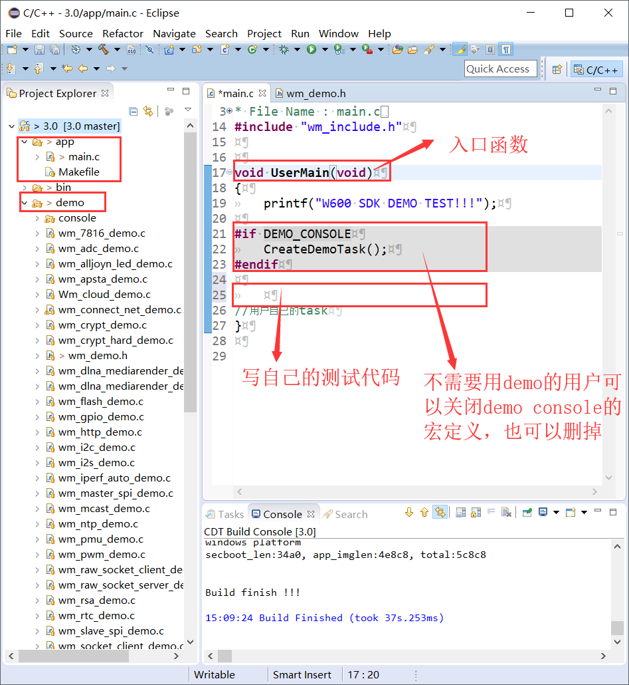

W600 SDK参考示例
================

概述：
------

用户新拿到W600系列开发板或者模组，都需要先测试一下功能和性能。

用户有两种方式做基本的功能性能测试：

-  1.使用W600 SDK自带的DEMO测试系统，直接测试；
-  2.参考SDK提供的示例，自行编译代码测试；

1. W600 SDK DEMO测试系统
------------------------

为基于 W600 芯片 WMSDK
进行二次开发的软件开发工程师提供相关功能的代码示例，直接修改对应demo的宏定义，编译即可使用控制台调试。

参考资料：:download:`W600_SDK DEMO运行指南 </upload/sdk/W600_SDK DEMO运行指南.pdf>` 

**优点：**

-  无需编写任何代码；
-  容易上手，按指令操作；
-  测试项目全面；

**测试截图：**

2.参考SDK示例，自行编写
-----------------------

W600 DEMO测试系统基于 demo/xxxx.c 的所有demo文件完成，提供所有测试
demo的代码，用户可以根据这些DEMO编写测试程序。

**优点**

-  测试的功能更完善详细；
-  可以熟悉W600 SDK的开发；

结束
----

看到这里，用户已经可以做W600系列的基本功能、性能测试了。

