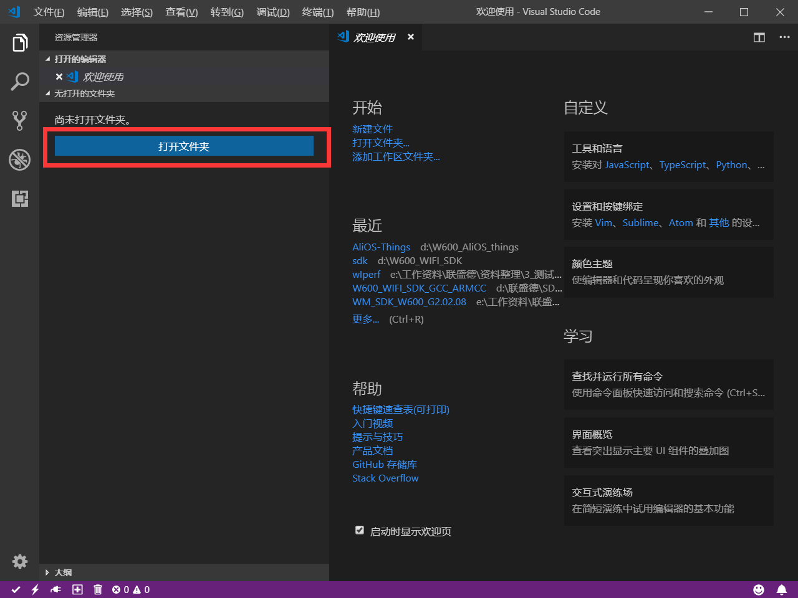
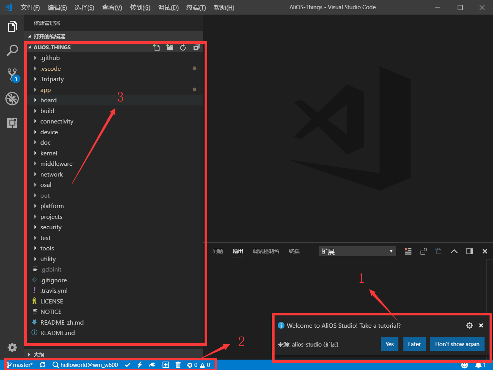
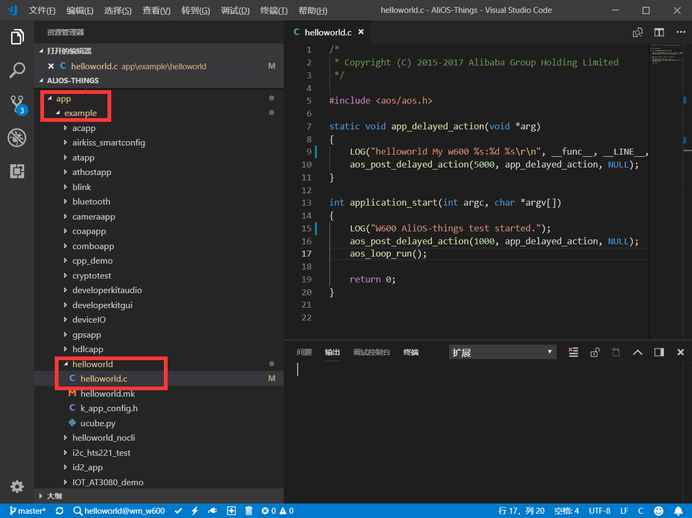
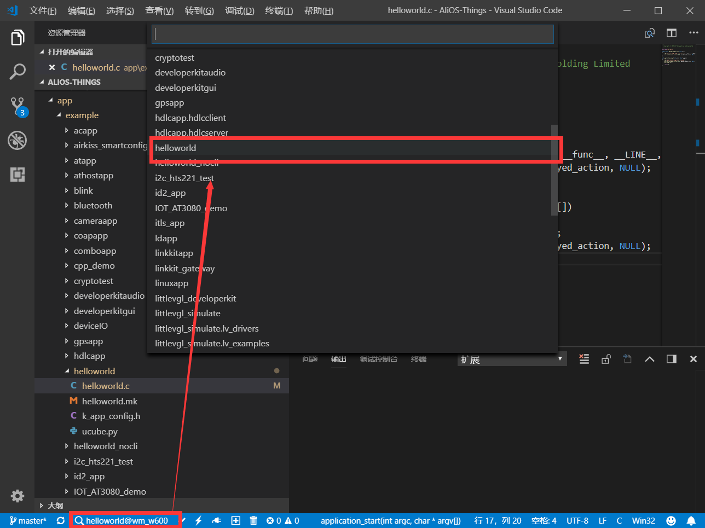
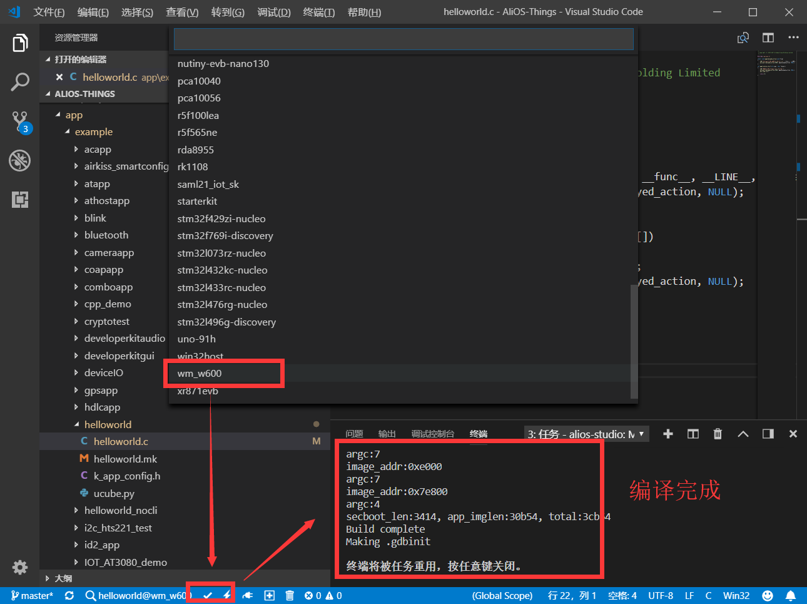
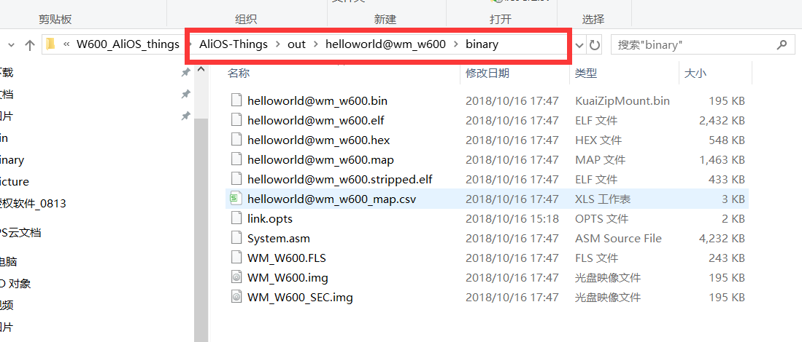
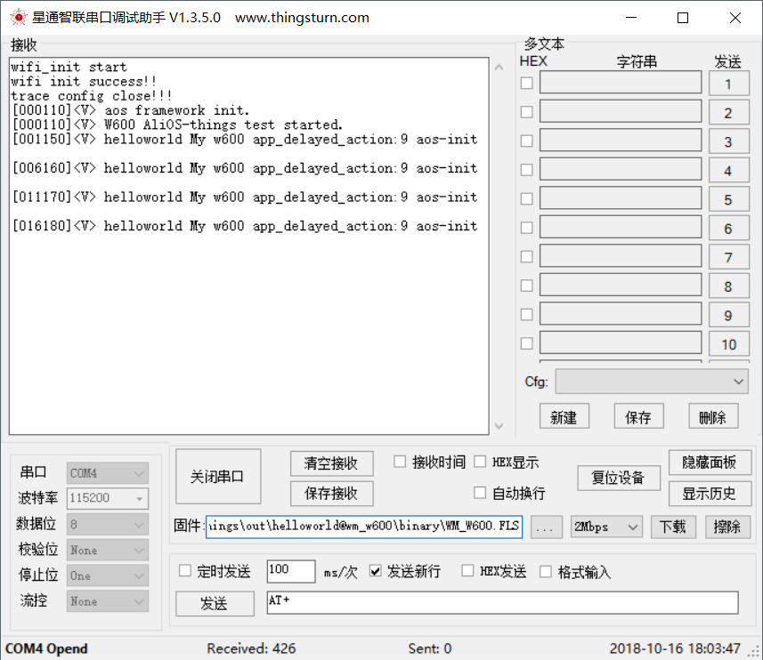

AliOS-things for W600 入门指导
==============================

概述
----

AliOS
Things是面向IoT领域的轻量级物联网嵌入式操作系统。致力于搭建云端一体化IoT基础设备。具备极致性能，极简开发、云端一体、丰富组件、安全防护等关键能力，并支持终端设备连接到阿里云Link，可广泛应用在智能家居、智慧城市、新出行等领域。

W600是联盛德新一代支持多接口、多协议的无线局域网802.11n（1T1R）低功耗
WLAN SoC 芯片。芯片内置 Cortex-M3 CPU处理器和Flash，集成射频收发前端RF
Transceiver，CMOS
PA功率放大器，基带处理器/媒体访问控制，集成电源管理电路，支持丰富的外围接口，
支持多种加解密协议。芯片内部集成了 RF
Switch、Balun、低噪声放大器、滤波器、功率放大器、电源管理模块等，此外还内置了1MByte
Flash，使得芯片外围电路器件更少，且模块体积更小、成本更优。W600提供给客户的二次开发空间更大、芯片外围电路器件更少、开发更简便，性价比更优势。

W600 与 Alios Things的碰撞将会擦出不一样的花火。

准备工作
--------

-  开发板：TB-01开发板 或 W600系列模组、开发板（\ `购买链接 <http://shop.thingsturn.com/>`__\ ）

-  SDK下载：https://github.com/alibaba/AliOS-Things.git

-  软件：`串口调试助手 </download/common>`__ 

环境搭建
--------

1. SDK下载
~~~~~~~~~~

安装Git使用命令 下载Alios-thing SDK :
git clone https://github.com/alibaba/AliOS-Things.git

.. _环境搭建-1:

2. 环境搭建
~~~~~~~~~~~

环境搭建教程参考：AliOS-things技术文档：\ `AliOS-things 环境搭建 <https://github.com/alibaba/AliOS-Things/wiki/AliOS-Things-Windows-Environment-Setup>`__\

测试
----

1.导入文件
~~~~~~~~~~

点击打开文件夹，导入 **Alios-things SDK** ;

   
导入后，界面上显示如下图示，

-	1.1 点击弹出的弹框选项，选择 yes;

-	1.2 左下角处为 **AliOS-things** 的控件，用来选择工程、芯片型号、编译等；

-	1.3 **AliOS-things** SDK目录结构，请参考\ `AliOS-things技术概述 <https://github.com/alibaba/AliOS-Things/wiki/AliOS-Things-Technical-Overview>`__\。

   
2.选择示例项目
~~~~~~~~~~~~~~

2.1 打开工程的 **app/example/helloword** 目录下的 **helloword.c**
文件，添加一些测试打印信息；

   
2.2 操作 **AliOS-things** 的插件，选择要编译的工程；

   
2.3 点击选定的 *helloworld*
工程后，继续选择芯片\ **wm_w600**\ ，然后点击空间编译；

   
3. 烧录固件
~~~~~~~~~~~

编译完成的固件在 **AliOS-things/out/helloworld@wm_w600/binary**
\ ``烧录遇到问题的用户请参考:``\   `W600固件烧录指南 </upload/application_note/download_firmware/>`__

   
烧录固件参考 xxxxx

   
结束
----

到此 ，已经可以初步尝试 AliOS-things for W600 的初步调试。

更多 Alios-things 资料可以参考：AliOS-things技术文档：\ `AliOS-things技术文档 <https://github.com/alibaba/AliOS-Things/wiki>`__\

