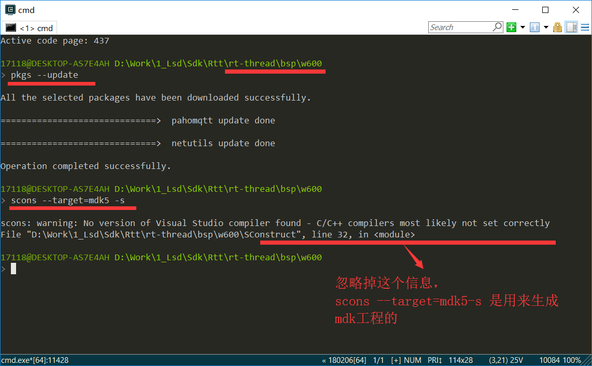
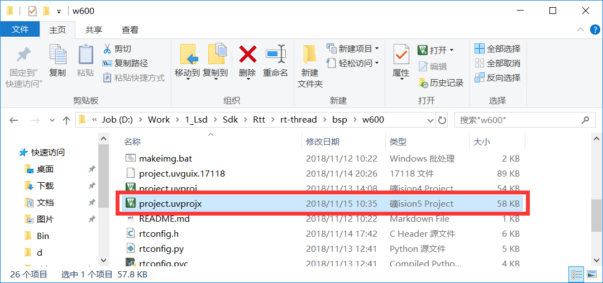
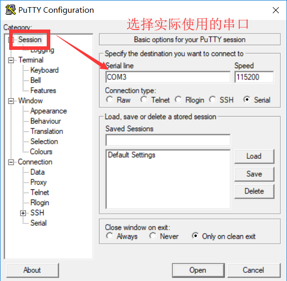
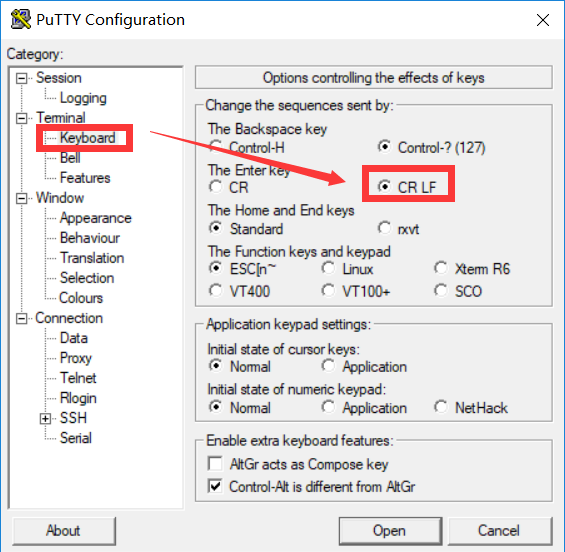
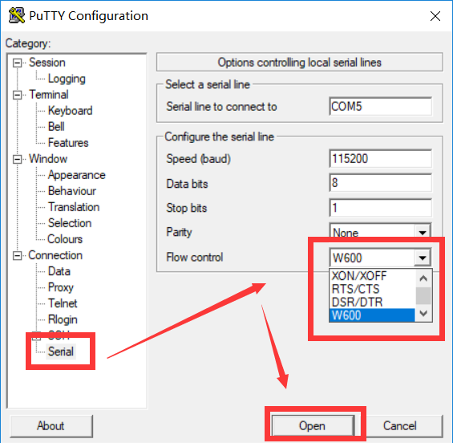
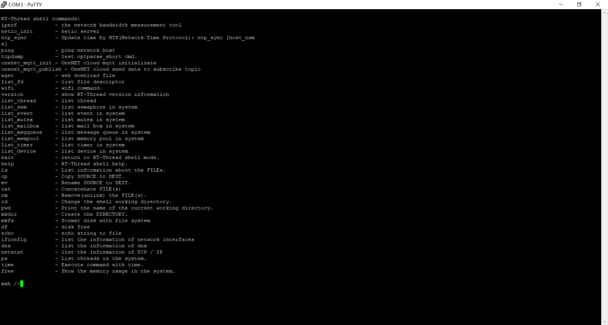
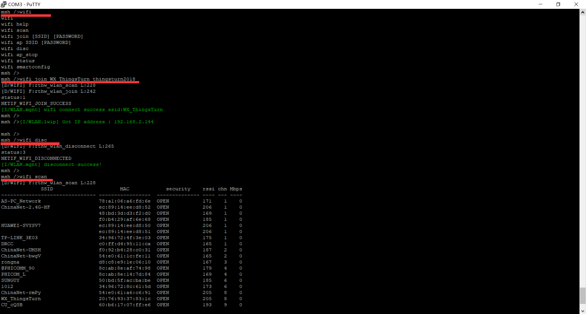

W600 RT-Thread入门指导教程
==========================

RT-Thread 简介
--------------

`RT-Thread <http://www.rt-thread.org/>`__
是一个来自中国的开源物联网操作系统，它具备非常强的可伸缩能力：从一个可以运行在
ARM Cortex-M0 芯片上的极小内核，到中等的 ARM Cortex-M3/4/7
系统，甚至是运行于 MIPS32、ARM Cortex-A 系列处理器上。 RT-Thread
项目的源代码托管在 `GitHub repo <https://github.com/rt-thread>`__ 上。

一、准备工作
--------

-  W600_RT-Thread SDK下载 https://github.com/flyingcys/w600
-  RT-Thread 源码：https://github.com/RT-Thread/rt-thread
-  RT-Thread env工具：https://github.com/RT-Thread/env
-  串口下载工具：`串口调试助手 </download/common>`__ 
-  Putty调试工具（w600）：https://github.com/w600/putty
-  硬件：TB-01开发板 或
   W600系列模组、开发板（\ `购买链接 <http://shop.thingsturn.com/>`__\ ）

二、环境搭建
--------

完成环境搭建之前，建议先把W600的 Keil环境
搭建完成，完成了一些必备的准备工作。W600
RT-Thread后续将支持linux版本。SDK持续完善中。

2.1 SDK下载
~~~~~~~~~~

2.1.1 RT-Thread 源码下载
^^^^^^^^^^^^^^^^^^^^^^

使用git ，从github上下载RT-Thread源码

 | **git clone https://github.com/RT-Thread/rt-thread.git**

2.1.2 W600_RT-Thread 源码下载
^^^^^^^^^^^^^^^^^^^^^^^^^^^

使用git ，从github上下载W600_RT-Thread源码

 | **git clone https://github.com/flyingcys/w600.git**
	
根据github上的注释，将W600_RT-Thread的源码复制到RT-Thread根目录下的bsp文件夹下。

2.2 RTT env工具搭建使用
~~~~~~~~~~~~~~~~~~~~~~

2.2.1 RT-Thread ENV工具简介
^^^^^^^^^^^^^^^^^^^^^^^^^

ENV工具是RT-Thread简单易用的配置裁剪工具，用来对内核和组件的功能进行配置，对组件进行自由裁剪，使得系统以搭积木的方式进行构建，简单方便。

2.2.2 RT-Thread ENV搭建使用
^^^^^^^^^^^^^^^^^^^^^^^^^

使用git ，从github上下载RTT env源码 ，具体教程参考\ `env使用教程视频 <https://mp.weixin.qq.com/s?__biz=MzIwMzA2NzI1Ng==&mid=2655155116&idx=1&sn=abe8ed7ddf7eca225b4e38e80b83a6c7&chksm=8d63c9bbba1440ad15d3205a4ab89359241394dbd7b76a5d584e70160b22aa997bafb9e97538&scene=0#rd>`__\

 | **git clone https://github.com/RT-Thread/env.git**

2.2.3使用ENV工具生成mdk工程
^^^^^^^^^^^^^^^^^^^^^^^^^

右键打开ComEmu，进入rt-thread:raw-latex:`\bsp`:raw-latex:`\w`600
目录，使用命令 pkgs –update 更新资料，然后使用命令scons –target=mdk5 -s
重新生成mdk5工程。

查看rt-thread:raw-latex:`\bsp`:raw-latex:`\w`600
目录下的文件，MDK5工程已经更新。

三、编译烧录
--------

3.1 编译
~~~~~~~~

点击使用ENV工具生成的MKD5工程，点击编译。

.. image:: start.assets/1542250455401.png

3.2 烧录测试
~~~~~~~~~~~~

烧录生成的固件，查看上电信息，使用命令ps查看一下系统进程，做一下简单测试

四、测试
--------

使用星通智联串口下载调试软件，并不能够达到良好的调试体验，接下来我们使用Putty进行调试。

4.1 下载Putty 调试工具
~~~~~~~~~~~~~~~~~~~~~~

使用git 从github下载Putty调试工具

 | **git clone https://github.com/w600/putty.git**

4.2 配置Putty
~~~~~~~~~~~~~

参考文件下的readme文件；

点击下载的 Putty.exe,然后开始配置Putty调试工具

4.3 使用Putty 调试
~~~~~~~~~~~~~~~~~~

使用Tab键，可以查看当前可用命令,或者使用help查看

使用命令连接wifi

五、其他
--------

RT-Thread
可以使用ENV工具配置软件开发包，下篇文档将讲解如何使用W600的RT-Thread固件连接Onenet,进行数据收发。
更多资料请参考：\ `RT-Thread 在线文档中心 <https://www.rt-thread.org/document/site/>`__\